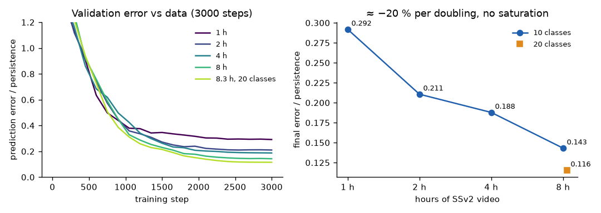
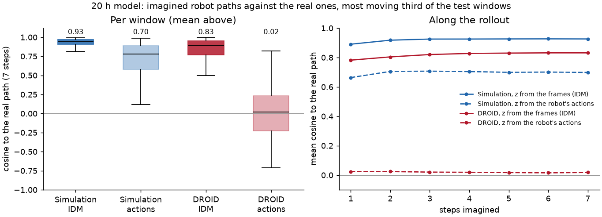

# Human-to-Robot

**Learning latent actions and visual dynamics from unlabeled human videos, then planning with them on a robot.**

Can an action-conditioned world model trained on human videos, without action labels, drive a robot with a different embodiment? We train a ViT encoder from scratch, an inverse dynamics model (IDM) and a JEPA-style predictor on 20 h of Something-Something v2. Robot actions enter through a small controller that maps them to the model's latent actions, and a CEM planner uses the model on a Panda arm in Robosuite.

So far: the model predicts human video well, and it follows robot paths when its latent actions are inferred from the frames. The robot's own actions drive it much less.


*Closed-loop planning with the 20 h model: at each step the CEM plans the next action toward the next frame of a demonstration, the action is executed, and the model replans from the new image. This is the best episode (validation episode 20): reach at step 13, grasp at 25, lift at 26; the cube drops at step 30. It is the only lift out of 20 episodes in this setting.*


## Results

Current model (20 h, details in [Current model](#current-model)). Every number is set beside a reference. **Persistence** is the forecast that nothing changes (ŝ_t+1 = s_t); errors are given as a fraction of its error, so below 1 beats it.

| Measure | Model | Reference |
|---|---|---|
| Next-state error, held-out SSv2 | 0.0135 | persistence (no change) 1 |
| 7-step rollout error, held-out SSv2 | 0.013 | persistence 1 |
| Motion invented on still clips (predicted / true change) | 1.09 | 1 = nothing invented |
| Robot paths over 7 steps, simulation: cosine to the real path, z from the IDM / from the robot's actions | 0.93 / 0.70 | DROID: 0.83 / 0.02 |
| Hit rate Top-1 / Top-5 of the true actions among 64, goal 3 steps ahead | 10.4 % / 31.9 % | chance 1.6 % / 7.8 % |
| Offline FDE: Δxyz L1 error of the CEM plan, goal 7 steps ahead | 0.122 | zero plan 0.087, another episode's move 0.130 |
| Same, 1 action toward the next frame: gain on the zero plan, all clips / most moving third | −0.006 / +0.0045 | 0 = as good as not moving |
| Closed loop, 20 episodes: reach / grasp / lift, best of 7 planner settings for each stage taken separately (no single setting reaches 7 / 3 / 1) | 7 / 3 / 1 | recorded actions 18 / 19 / 16, zero plan 0 / 0 / 0 |
| Gripper closure readable from the state (linear probe R²) | 0.04 | frozen DINOv2-S: 0.84 |

Measured on held-out SSv2 at step 20,000:

| Metric | Value |
|---|---|
| Error / persistence | 0.0135 |
| 7-step gain over persistence | 0.987 |
| Controllability | 0.99 |
| Leak | 0.015 |
| Invented motion | 1.09 |
| Rank of the states (RankMe) | 72 / 192 |
| Active dimensions of z | 8 / 64 |
| Action class from z | 0.015 (chance 0.006) |
| Left / right from z | 0.50 (chance 0.50) |
| Hand R² from the encoder | 0.08 |

**More video keeps helping.** Prediction error falls about 20 % per doubling of SSv2 video, with no saturation up to 8 h; more classes at equal hours help more (3,000-step runs).



**The robot paths follow the frames, not the robot's actions.** Seven open-loop steps from a real state, on the most moving third of the test windows (747 in simulation, 648 on DROID), each with the controller trained on its own data. With z inferred from the frames by the IDM, the imagined path follows the real one (cosine 0.93 in simulation, 0.83 on DROID). With z from the robot's real actions through the controller, it drops to 0.70 in simulation and to 0.02 on DROID.



## Current model

The reference world model is the 20 h run: `wm-cls-ssv2-20hall-k2from1050-b3e-4-20k`, checkpoint `step-20000.pt`, trained at commit `248588a`.

| Part | Specification | Parameters |
|---|---|---:|
| Encoder | ViT-tiny from scratch: 224 px, patch 14, 192-d, 12 layers, 3 heads | 5.50 M |
| Projector | MLP on the CLS token: 192 → 2048 → 192, BatchNorm, GELU | 0.79 M |
| IDM | Pairs (s_t, s_t+1), 2 transformer layers, 4 heads, read by one query; Gaussian z, 64-d | 1.36 M |
| Predictor | 6 layers, causal, 16 heads of 64, MLP 2048, AdaLN-zero on z, RoPE on time; predicts the next state directly | 10.80 M |
| Prediction projector | MLP: 192 → 2048 → 192, BatchNorm, GELU | 0.79 M |
| **Total** | | **19.25 M** |

| Training | Value |
|---|---|
| Data | SSv2 20 h: 19,301 videos, 20.9 h, 168 classes, 4 fps, no action labels |
| Clips | 8 consecutive frames (2 s), 7 transitions |
| Loss | teacher forcing + 2-step rollout from step 1,050 (last-gradient only, 3 states of context) + β KL + λ SIGReg |
| Weights | β 3e-4, λ 0.09 |
| Optimizer | AdamW, lr 1e-4, weight decay 1e-3, 10% warmup, gradient clip 1.0, bf16 |
| Length | 20,000 steps, batch 128, seed 0 |

## Quickstart

```bash
uv sync

# frame shards from a folder of videos (configs/data/config.yaml); our SSv2 copy on the Hub is private (licence)
uv run h2r data extract --set raw_dir=data/raw/ processed_dir=data/processed/

# world model, current recipe: 20,000 steps, 2-step rollout loss from epoch 1, β 3e-4
uv run h2r train wm --set name=<run> data.processed_dir=data/processed/ \
    loss.rollout_steps=2 loss.rollout_from_epoch=1 loss.beta=0.0003 iterations=20000

# controller (robot action -> z) on the simulated episodes, public: batgre/h2r-sim-v3
uv run h2r train controller --set world_model=outputs/<run> data.root=data/h2r-sim/ data.hf_repo=batgre/h2r-sim-v3

# closed-loop planning in robosuite Lift, dense subgoals t+1
uv run h2r plan run --set policy.controller=outputs/<controller run> policy.goal=dense policy.k=1 policy.horizon=1
```
